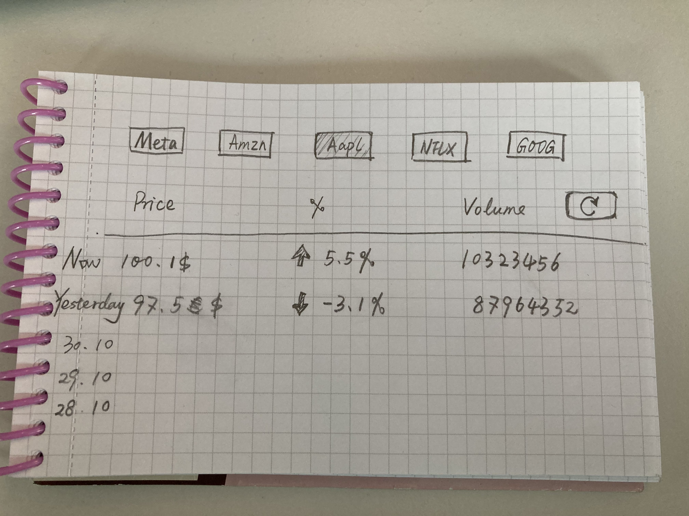

# Stock practice project

## Goals

Goal is to show the current stock price and some price history for the selected stocks.
You can change in between stocks by clicking the tabs up top.

- Build generic Tab component you can use with the selection between stock tickers in a way you could use it in any other project as well. Highlight current tab
- Show the current price details first in the list
- Show at least 5 previous days results following it. Show yesterdays result with separate yesterday title instead of timestamp.
- API's request limit is 500 requests / day. Day historic results could be stored to localstorage / cached
- Use red/green arrow icon to indicate if stock has gone up or down
- Separate refresh button to reload the current stock price of the selected ticker
- Show separate loading indicator when app is fetching data

Bonus: 
- UI looks nice
- Make layout responsive in a way that it's usable in all screen sizes

Next up (after previous goals are done)
- Server with authentication, user can manage personally followed stock tickers

## Rules to follow
- You can change the initial code however you want and use any libraries needed
- Use hooks for state management
- Since the app only has one page for now, you can use App.tsx as a container for it but keep it as place to wrap things together, make separate components for the parts that form the page.
- Handle state as close to the place it's used, don't put everything in global state
- Use preferably styled components for styling
- Build reusable layout components, no copy pasting or hardcoding values. 
- Preferably use typescript in all components
- Yarn is used as package manager. You can use npm instead, but stick to one.

## Data
Data comes from alpha vantage API, which is free public API to get stock related data. API usage is limited to 500 requests/ day. Both current price and historical data has been already set up for usage. You can find them from App.tsx

https://www.alphavantage.co/documentation/

# Getting Started with Create React App

This project was bootstrapped with [Create React App](https://github.com/facebook/create-react-app).

## Available Scripts

In the project directory, you can run:

### `yarn start`

Runs the app in the development mode.\
Open [http://localhost:3000](http://localhost:3000) to view it in the browser.

The page will reload if you make edits.\
You will also see any lint errors in the console.

### `yarn test`

Launches the test runner in the interactive watch mode.\
See the section about [running tests](https://facebook.github.io/create-react-app/docs/running-tests) for more information.

### `yarn build`

Builds the app for production to the `build` folder.\
It correctly bundles React in production mode and optimizes the build for the best performance.

The build is minified and the filenames include the hashes.\
Your app is ready to be deployed!

See the section about [deployment](https://facebook.github.io/create-react-app/docs/deployment) for more information.

### `yarn eject`

**Note: this is a one-way operation. Once you `eject`, you can’t go back!**

If you aren’t satisfied with the build tool and configuration choices, you can `eject` at any time. This command will remove the single build dependency from your project.

Instead, it will copy all the configuration files and the transitive dependencies (webpack, Babel, ESLint, etc) right into your project so you have full control over them. All of the commands except `eject` will still work, but they will point to the copied scripts so you can tweak them. At this point you’re on your own.

You don’t have to ever use `eject`. The curated feature set is suitable for small and middle deployments, and you shouldn’t feel obligated to use this feature. However we understand that this tool wouldn’t be useful if you couldn’t customize it when you are ready for it.

## Learn More

You can learn more in the [Create React App documentation](https://facebook.github.io/create-react-app/docs/getting-started).

To learn React, check out the [React documentation](https://reactjs.org/).
